<font size = 8>**SMB v3_RCE_POC分析报告**</font>


# 简介

>2020年3月12日，微软官方纰漏了SMB V3（CVE-202-0796）漏洞，并表示该漏洞存在远程代码执行的可能。在4月份就有人证明并演示了如何利用该漏洞进行远程代码执行。而在2020年6月2日，国外安全研究员便将远程代码执行的POC公开了，使得漏洞利用风险骤然升级。本文章便结合公开的POC来简单的介绍一下如何利用CVE-202-0796来进行远程代码执行的（由于本人能力有限，后续复杂的寻找指令指针寄存器的相关内容仍需进一步分析和研究）

# 漏洞原理分析

SMB v3支持数据压缩，当收到经过压缩的数据包时，srv2.sys中的Srv2DecompressData函数便会对数据进行解压缩，但在解压的时候，对数据的大小计算出现了整型溢出，从而导致开辟的空间小于要实际要拷贝的数据，最终导致拷贝时产生溢出。

## 数据包协议分析

SMB v3 Compression数据包传送时需要使用SMB2COMPRESSION_TRANSFORM_HEADER头，微软文档对该头结构描述如图：

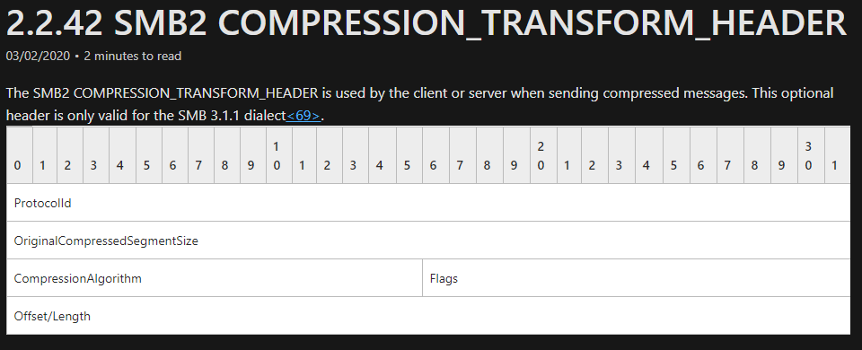

SMB2COMPRESSION_TRANSFORM_HEADER头中需要我们留意两个值，一个是描述压缩数据大小的OriginalCompressedSegmentSize，另一个是描述压缩数据相对包头的偏移Offset。正是这两个值相加导致的整型溢出。SMB v3 Compression数据包结构大致如图：

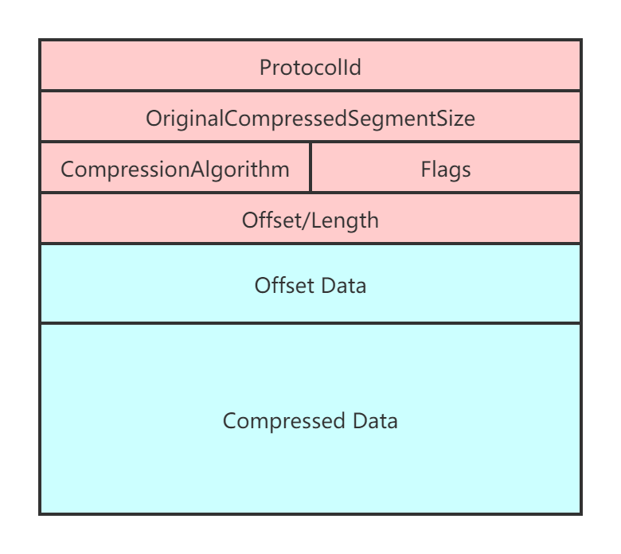

## 溢出点分析

srv2!Srv2DecompressData函数接受到客户端发送的压缩数据包，分配所需内存空间，然后解压数据并放置分配的内存空间中。如果Compression数据包Offset字段不为空时，则将Offset Data原样放置在解压缩数据之前，也就是缓冲区的开头。以下是Srv2DecompressData函数的简化代码：

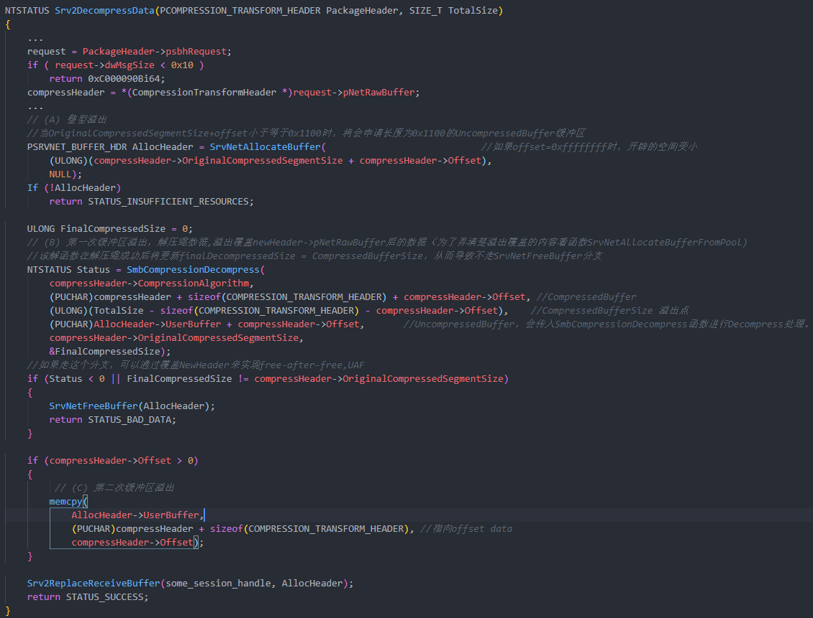

```C
NTSTATUS Srv2DecompressData(PCOMPRESSION_TRANSFORM_HEADER PackageHeader, SIZE_T TotalSize)
{
    ...
    request = PackageHeader->psbhRequest;
    if ( request->dwMsgSize < 0x10 )
        return 0xC000090Bi64;
    compressHeader = *(CompressionTransformHeader *)request->pNetRawBuffer;
    ...
    // (A) 整型溢出
    //当OriginalCompressedSegmentSize+offset小于等于0x1100时，将会申请长度为0x1100的UncompressedBuffer缓冲区
    PSRVNET_BUFFER_HDR AllocHeader = SrvNetAllocateBuffer(                            //如果offset=0xffffffff时，开辟的空间变小
        (ULONG)(compressHeader->OriginalCompressedSegmentSize + compressHeader->Offset),
        NULL);
    If (!AllocHeader) 
        return STATUS_INSUFFICIENT_RESOURCES;
 
    ULONG FinalCompressedSize = 0;
    // (B) 第一次缓冲区溢出，解压缩数据,溢出覆盖newHeader->pNetRawBuffer后的数据（为了弄清楚溢出覆盖的内容看函数SrvNetAllocateBufferFromPool)
    //该解函数在解压缩成功后将更新finalDecompressedSize = CompressedBufferSize，从而导致不走SrvNetFreeBuffer分支
    NTSTATUS Status = SmbCompressionDecompress(
        compressHeader->CompressionAlgorithm,
        (PUCHAR)compressHeader + sizeof(COMPRESSION_TRANSFORM_HEADER) + compressHeader->Offset, //CompressedBuffer
        (ULONG)(TotalSize - sizeof(COMPRESSION_TRANSFORM_HEADER) - compressHeader->Offset),    //CompressedBufferSize 溢出点
        (PUCHAR)AllocHeader->UserBuffer + compressHeader->Offset,       //UncompressedBuffer，会传入SmbCompressionDecompress函数进行Decompress处理。
        compressHeader->OriginalCompressedSegmentSize,
        &FinalCompressedSize);
    //如果走这个分支，可以通过覆盖NewHeader来实现free-after-free,UAF
    if (Status < 0 || FinalCompressedSize != compressHeader->OriginalCompressedSegmentSize) 
    {
        SrvNetFreeBuffer(AllocHeader);
        return STATUS_BAD_DATA;
    }
    if (compressHeader->Offset > 0) 
    {
         // (C) 第二次缓冲区溢出
        memcpy(
            AllocHeader->UserBuffer,
            (PUCHAR)compressHeader + sizeof(COMPRESSION_TRANSFORM_HEADER), //指向offset data
            compressHeader->Offset);
    }
    Srv2ReplaceReceiveBuffer(some_session_handle, AllocHeader);
    return STATUS_SUCCESS;
}
```

数据包被函数Srv2DecompressData处理的示意图：

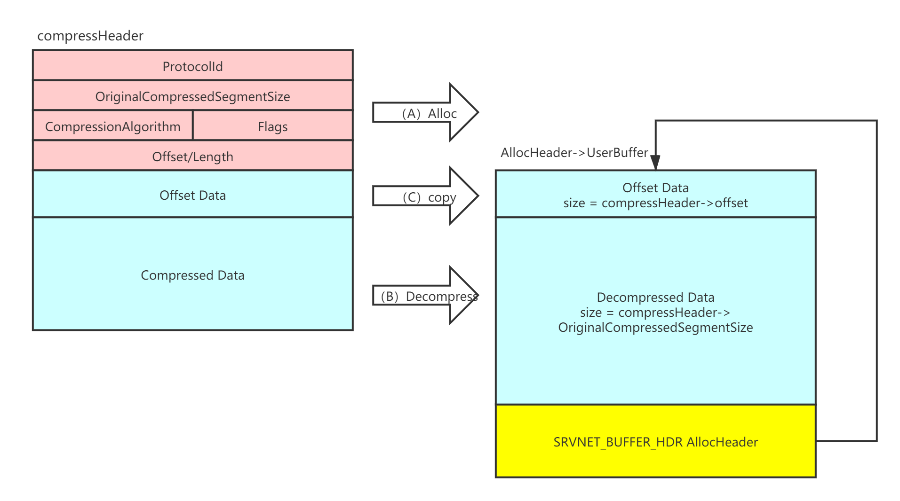

### 开辟内存空间

在代码A处SrvNetAllocateBuffer函数申请内存空间，第一个参数为originalCompressedSegSize加上offset的值表示要开辟空间的大小。由于该函数是直接使用eax和ecx来将两数相加，然后取结果的4字节作为参数开辟空间，没有考虑到进位的情况，产生整型溢出从而导致开辟的空间比实际的小。例如originalCompressedSegSize大小为0xffffffff，Offset大小为0x10，两个数相加结果应该为0x10000000f，而由于没有考虑进位，实际作为参数传进去的大小便为0xf，导致开辟的内存空间远远小于实际大小。反汇编代码如图：

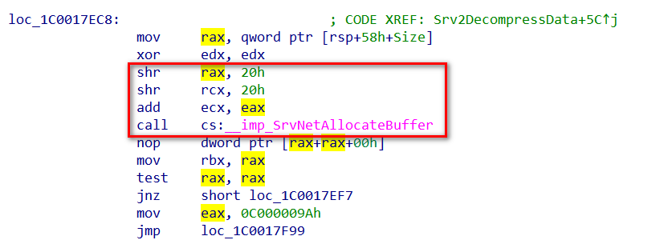

#### 深入分析SrvNetAllocateBuffer

Srvnet!SrvNetAllocateBuffer会根据所需分配空间大小进行判断。当所需大小大于16MB时将不进行分配，所需大小大于1MB小于16MB时，调用函数SrvNetAllocateBufferFromPool进行分配空间。其余小于1MB的数据使用后备列表（Lookaside List）来进行分配。以下是SrvNetAllocateBuffer函数的简化代码：

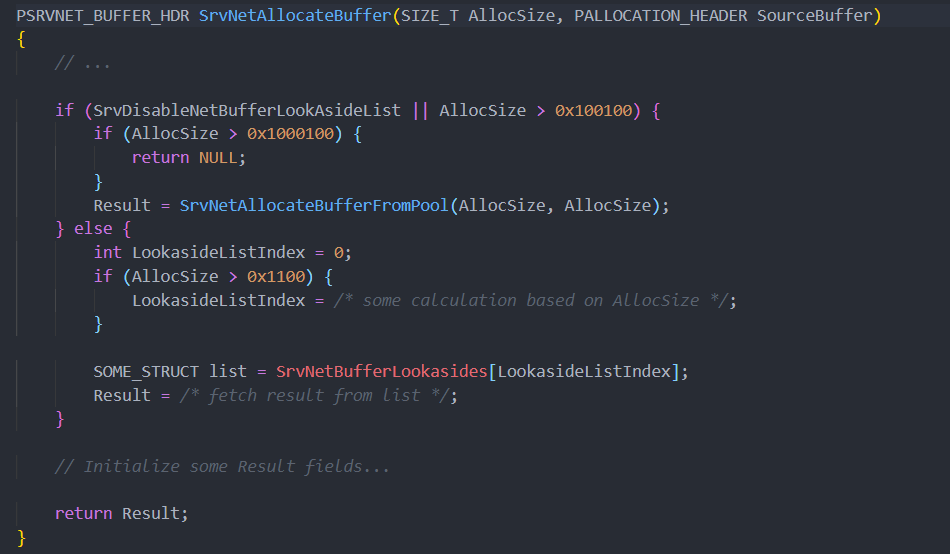

```C
PALLOCATION_HEADER SrvNetAllocateBuffer(SIZE_T AllocSize, PALLOCATION_HEADER SourceBuffer)
{
    // ...
    if (SrvDisableNetBufferLookAsideList || AllocSize > 0x100100) {
        if (AllocSize > 0x1000100) {
            return NULL;
        }
        Result = SrvNetAllocateBufferFromPool(AllocSize, AllocSize);
    } else {
        int LookasideListIndex = 0;
        if (AllocSize > 0x1100) {
            LookasideListIndex = /* some calculation based on AllocSize */;
        }
        SOME_STRUCT list = SrvNetBufferLookasides[LookasideListIndex];
        Result = /* fetch result from list */;
    }
    // Initialize some Result fields...
    return Result;
}
```

其中值得关注的是后备列表，是Windows内核提供的一种机制，用于有效地为驱动程序保留一组可重用的固定大小的缓冲区。由于每次调ExAllocatePoolWithTag和ExFreePoolWithTag都花费大量时间，因此内核驱动程序通常会为其自身的数据结构提供一个后备列表，当后备列表数据结构初始化完成时，后续从列表中检索元素时就无需再次初始化了，以提高效率。这表明我们可以破坏表头，将其添加到列表中，然后在以后的请求中从列表中检索复用，从而达到漏洞利用的目的。

函数SrvNetAllocateBuffer这里用到的后备列表SrvNetBufferLookasides也是如此，在函数SrvNetCreateBufferLookasides初始化之后，便可以从列表中检索元素复用，并且在初始化也同样是调用SrvNetAllocateBufferFromPool来开辟空间的只不过后备列表是提前开辟好的固定大小。SrvNetAllocateBuffer函数这里提供了9个后备列表，其中大小分别为：[0x1100,0x2100,0x4100,0x8100,0x10100,0x20100,0x40100,0x80100,0x100100]。

SrvNetAllocateBuffer最终都是通过调用SrvNetAllocateBufferFromPool来开辟空间的，但该函数返回的并不是指向开辟缓冲区的指针，而是SRVNET_BUFFER_HDR结构体，开辟的缓冲区就位于该结构体上方。这种布局为后续溢出提供了可能。布局可见上面Srv2DecompressData处理的示意图。SRVNET_BUFFER_HDR结构信息如图：

```c
struct __declspec(align(8)) SRVNET_BUFFER_HDR
{
  LIST_ENTRY List;      
  USHORT Flag;          
  BYTE unknown0[4];     
  WORD unknown1;        
  PBYTE pNetRawBuffer; //point to userbuffer 
  DWORD dwNetRawBufferSize;
  DWORD dwMsgSize;
  DWORD dwNonPagedPoolSize;
  DWORD dwPadding;
  PVOID pNonPagedPoolAddr;
  PMDL pMDL1; // points to mdl1
  DWORD dwByteProcessed;
  BYTE unknown2[4];
  _QWORD unknown3;
  PMDL pMDL2; // points to mdl2
  PSRVNET_RECV pSrvNetWskStruct;
  DWORD unknown4;
  char unknown5[12];
  char unknown6[32];
  MDL mdl1; // variable size
  char unknow7[24];
  MDL mdl2; // variable size
};
```

### 解压缩数据

在代码B处SmbCompressionDecompress函数解压缩收到的压缩数据。解压后的Decompress Data数据被放到AllocHeader->UserBuffer+Offset(OriginalCompressedSegmentSize的值不影响函数的运行结果)。由于在A处的整型溢出开辟了0x1100（后备列表中的最小值）的缓冲区空间，因此只要构造Offset Data + Decompress Data大于0x1100的数据就能覆盖紧跟在缓冲区后面的AllocHeader结构。被覆盖的AllocHeader结构中有两个值需要关注，后面漏洞利用会用上。

- 偏移为0x18的AllocHeader->UserBuffer,指向存放Offset Data + Decompress Data的缓存区。

- 偏移为0x38的AllocHeader->PMDL1,指向MDL1结构。

### 拷贝Offset Data数据

在代码C处memcpy函数将压缩数据包中的Offset Data拷贝到AllocHeader->UserBuffer中（解压缩数据之前）。不过在B处执行SmbCompressionDecompress时存在缓冲区溢出的可能，如果将AllocHeader->UserBuffer的值覆盖为指定地址，并且Offset Data数据和大小，以及Decompress Data（未压缩的数据）的值也都是我们可以控制的。因此就可以实现任意内存写操作了。

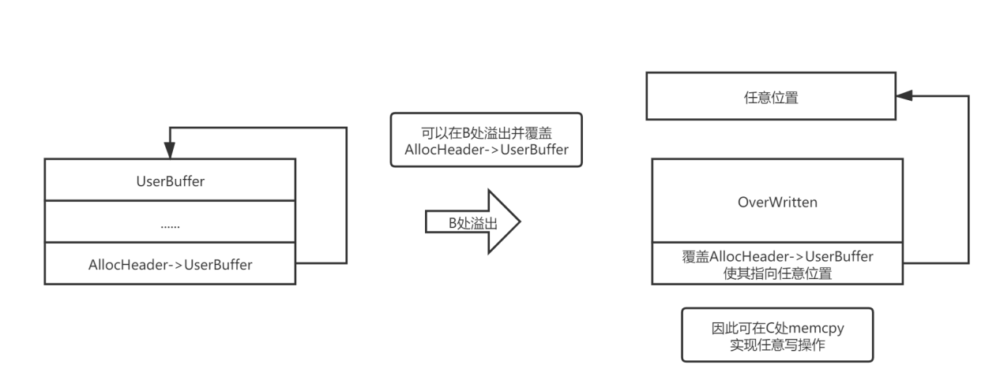

# 漏洞利用分析

## 本地权限提示

本地提权（Exp）利用前面所描述的任意内存写操作修改SEP_TOKEN_PRIVILEGES结构中的关键数据来提升自身权限。首先提权程序先获取自身token，通过0x40偏移取得SEP_TOKEN_PRIVILEGES结构的首地址XXXX,结构如图：

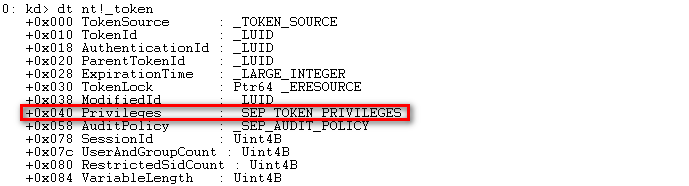

SEP_TOKEN_PRIVILEGES结构中包含与令牌相关的特权信息。其中Present为令牌当前可用权限；Enable为已启用的权限；EnabledByDefault为默认情况下已启用的权限。它们都采用8字节数据来存储特权的flag，从低位起每一个bit位代表一个指定的特权。结构如图：

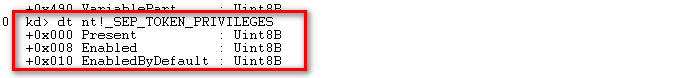

然后通过该漏洞精准覆盖AllocHeader->UserBuffer地址为XXXX，将Offset Data的值设置为两个0x1ff2ffffbc（system进程中的Present为此值），分别用于覆盖当前进程的Present和Enable值，从而实现权限提升。

## 远程代码执行

远程代码执行相对于本地权限提升就要复杂的多。当想要实现远程代码执行需要两个条件，一个条件是远程主机内存中写shellcode，另一个条件是控制指令指针寄存器指向这段shellcode中去执行。

### 远程写shellcode

往远程主机内存中写shellcode，根据之前分析的任意内存写操作已经可以实现了，只需要将内核态的shellcode和用户态的shellcode写入KUSER_SHARED_DATA中，这是一个在用户域和内核域中映射的结构（和页面）。它的地址是0x7ffe0000和0xfffff78000000000，在用户域和内核域分别设置为r--和rw-。

### 控制指令指针寄存器

要想控制指令指针寄存器，首先需要实现任意内存读取操作。

#### 任意内存读取

由于我们通过溢出覆盖AllocHeader->UserBuffer来实现任意内存写操作，是通过请求数据包来实现的，服务器将保持沉默或最多返回正常相应不会立即提供任何信息。幸运的是srv2.sys提供了一个可以利用的函数srv2!Srv2SetResonseBufferToReceiveBuffer:

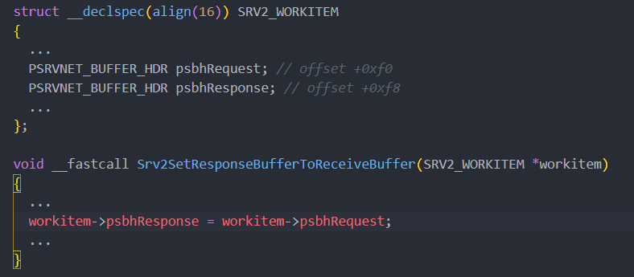

```c
struct __declspec(align(16)) SRV2_WORKITEM
{ 
  ...
  PSRVNET_BUFFER_HDR psbhRequest; // offset +0xf0
  PSRVNET_BUFFER_HDR psbhResponse; // offset +0xf8
  ...
};
void __fastcall Srv2SetResponseBufferToReceiveBuffer(SRV2_WORKITEM *workitem)
{
  ...
  workitem->psbhResponse = workitem->psbhRequest;
  ...
}
```

请求和响应在有效负载中共享许多公共部分，使用此功能能有效地重用缓冲区，因此提供了利用的可能。正如srv2!Srv2SetResponseBufferToReceiveBuffer函数在准备响应缓冲区时，不会再次初始化缓冲区（SRVNET_BUFFER_HDR）。因此我们只需要调用此函数，便能通过控制请求缓冲来实现控制响应缓冲区。

##### 伪造MDL

现在可以控制响应缓冲区（SRVNET_BUFFER_HDR）了，剩下便是如何控制要读取的内容了。由于tcpip.sys最终依赖DMA(Direct Memory Access直接内存访问)来传输数据包的，因此驱动程序会维护MDL中缓冲区的物理地址。MDL结构如下：

```C
typedef struct{
  QWORD            _MDL;      
  USHORT           Size;
  USHORT           MdlFlags;
  USHORT           AllocationProcessorNumber;
  USHORT           Reserved;
  QWORD            Process;
  QWORD            MappedSystemVa;
  QWORD            StartVa;
  ULONG            ByteCount;
  ULONG            ByteOffset;
  // Actually physical addresses follow. 
  // Therefore, the size of this struct is variable
} MDL, PMDL;
```

POC中伪造的MDL如图：

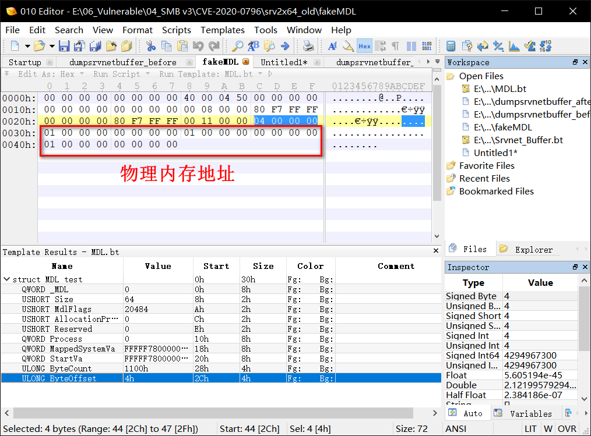

在SRVNET_BUFFER_HDR中，PMDL1和PMDL2是执行MDL结构的指针，这些结构描述了包含tcpip.sys发送给客户端的数据内存。因此我们可以通过任意内存写，先将构造好的伪造的MDL写到KUSER_SHARED_DATA中，然后在通过溢出覆盖PMDL1指针，使其指向写入KUSER_SHARED_DATA中伪造的MDL，再通过触发函数Srv2SetResponseBufferToReceiveBuffer复用此SRVNET_BUFFER_HDR缓冲区结构，就能通过构造不同的MDL来实现从服务端任意物理内存读取数据的操作，示意图如下：

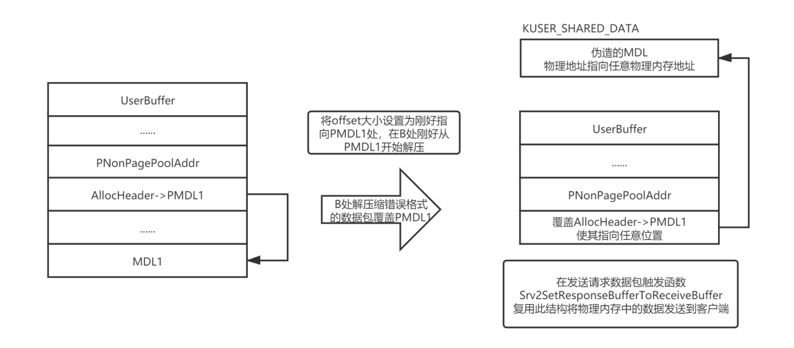

覆盖PMDL1以及触发函数Srv2SetResponseBufferToReceiveBuffer细节

如果我们像之前那样在B处直接覆盖AllocHeader->PMDL1势必会覆盖到PNonPagePoolAddr，给PNonPagePoolAddr一个无效的值，迟早会在srvnet!SrvNetFreeBuffer中产生崩溃。因此可以通过将Offset Data的大小设置为AllocHeader->PMDL1相对于AllocHeader->UserBuffer的偏移。这样在B处进行解压缩时便是从 AllocHeader->UserBuffer+Offset = AllocHeader->PMDL1处开始的，这样就可以在B处不影响PNonPagePoolAddr的值来实现覆盖AllocHeader->PMDL1

。不过这样在C处拷贝Offset Data时依旧会覆盖PNonPagePoolAddr导致崩溃，因此选择在B处构造错误的LZNT1（压缩格式）数据包。在B处解压错误的LZNT1数据包时，依旧能够覆盖PMDL，并直到解压缩到损坏模块为止，然后在发送请求数据包来触发Srv2SetResponseBufferToReceiveBuffer来实现任意物理内存读取（<font color = red><b>这里调试没有完全跟到是如何读取的物理内存地址数据的</b></font>）。

### 构造并执行ShellCode

<font color=red><b>下面的内容由于时间有限能力有限，对如何从内存地址中找到指令指针寄存器不是很清楚。根据自己的理解简单的描述了一下。</b></font>

有了任意物理内存读，然后通过在物理页面暴力搜索找到HAL的堆地址，然后从HAL的堆地址中找到HalpInterruptController和HalpApicRequestInterrupt两个值来构造内核态的Shellcode，。如图（其中HALP_APIC_REQ_INTERRUPT_OFFSET的值是写死的0x78）：

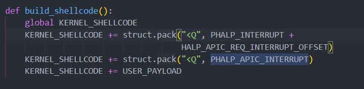

然后再通过任意内存写操作将构造好的ShellCode写到KUSER_SHARED_DATA地址上。最终通过任意内存写操作将指令指针（PHALP_INTERRUPT + HALP_APIC_REQ_INTERRUPT_OFFSET）指向KUSER_SHARED_DATA地址上的ShellCode去执行。写Shellcode和修改EIP操作如图：

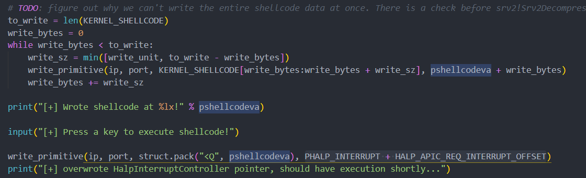

远程代码执行读写操作逻辑，如下图：

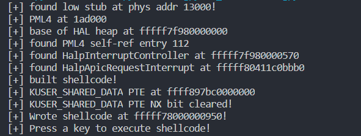

# CVE-2020-0796 相关参考文档

**SMB v3远程代码执行POC：**

https://github.com/chompie1337/SMBGhost_RCE_PoC

**SMB v3 本地提权POC：**

https://github.com/danigargu/CVE-2020-0796

**相关分析文档：**

https://mp.weixin.qq.com/s/rKJdP_mZkaipQ9m0Qn9_2Q

https://blog.zecops.com/vulnerabilities/exploiting-smbghost-cve-2020-0796-for-a-local-privilege-escalation-writeup-and-poc/

https://ricercasecurity.blogspot.com/2020/04/ill-ask-your-body-smbghost-pre-auth-rce.html